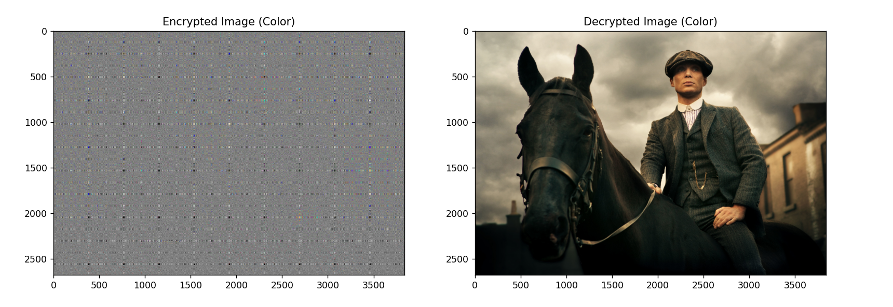
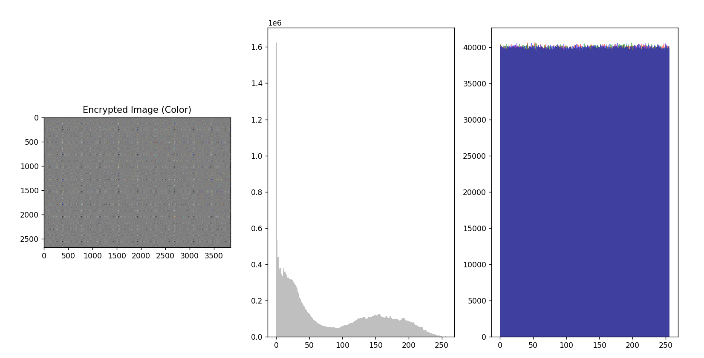

### Advanced Hybrid Image Encryption for Defense and Medical Security

#### Overview
This project implements an advanced encryption technique for color images using a hybrid of Fibonacci and Tribonacci sequences for confusion and diffusion phases, respectively. The encryption is robust and suitable for applications in defense and medical security where data integrity and confidentiality are paramount.

#### Features
- **Encryption:** Utilizes Fibonacci and Tribonacci sequences for robust encryption.
- **Decryption:** Implements inverse transformations to recover original images.
- **Performance:** Average encryption time computed for benchmarking.

#### Setup
1. **Clone the Repository:**
   ```bash
   git clone https://github.com/your_username/your_repository.git
   cd your_repository
   ```

2. **Install Dependencies:**
   - Python 3.x
   - Required libraries: PIL, numpy, matplotlib

   ```bash
   pip install pillow numpy matplotlib
   ```

#### Usage
1. **Encryption:**
   - Run the script and input the path to your color image.
   ```bash
   python encryption_script.py
   ```
   - Follow the prompts to enter the image path.

2. **Decryption:**
   - After encryption, you can decrypt the image:
   ```bash
   python decryption_script.py
   ```

#### Example
- Here's a sample run of the encryption script:
  

- Histogram Analysis:
  

#### License
This project is licensed under the MIT License - see the LICENSE file for details.

#### Support
- For any issues or questions, please contact [ajaiff18@gmail.com](mailto:your_email@example.com).

